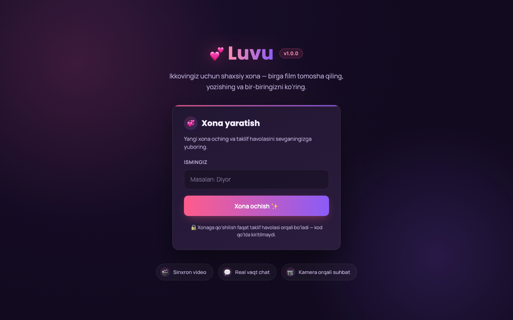

# 💕 Luvu

A private "watch party" room for two (or a small group) — synced video, live chat, and multi-person camera calls, built to stay usable even on slow or unstable mobile connections.



**Live:** [monvo.uz](https://monvo.uz)

## Features

- 🎬 **Synced playback** — paste a YouTube link and it starts, pauses, and seeks in sync for everyone in the room
- 💬 **Real-time chat** — with clickable links and full history replay when someone (re)joins
- 📹 **Mesh video calls** — up to 6 people, each with their own peer-to-peer camera/mic connection
- 🔗 **Link-only invites** — no manual room codes; join by clicking a shared link
- 📶 **Built for weak connections** — adaptive bitrate, automatic TURN relay fallback for NAT/CGNAT, and automatic ICE-restart recovery after a network blip
- 🔄 **Survives refreshes and drops** — a page reload or a brief connection drop silently rejoins the same room instead of losing it

## Tech stack

- **Backend:** Node.js, Express, [Socket.io](https://socket.io/) (rooms, chat relay, WebRTC signaling)
- **Realtime video:** native WebRTC (mesh topology — one `RTCPeerConnection` per remote participant)
- **NAT traversal:** self-hosted [coturn](https://github.com/coturn/coturn) TURN server with short-lived HMAC credentials
- **Frontend:** vanilla JS, no framework/build step
- **Deployment:** Docker Compose (`app` + `caddy` for automatic HTTPS + `coturn` for TURN relay)

## Running locally

```bash
npm install
node server.js
# → http://localhost:3000
```

Camera calls need a TURN server to work reliably outside a local network. Without one, `/api/ice-servers` just returns public STUN servers, which is enough for local testing.

## Deploying

The project ships as a `docker-compose.yml` with three services:

| Service  | Purpose |
|----------|---------|
| `app`    | Node/Express/Socket.io server |
| `caddy`  | Reverse proxy + automatic HTTPS |
| `coturn` | TURN relay for calls behind NAT/CGNAT |

```bash
cp .env.example .env   # fill in TURN_SECRET / TURN_HOST
docker compose up -d --build
```

Static assets are cache-busted per deploy (`?v=<git-commit>`) so a redeploy is always reflected immediately, even behind a CDN.

## License

MIT — see [LICENSE](LICENSE).
